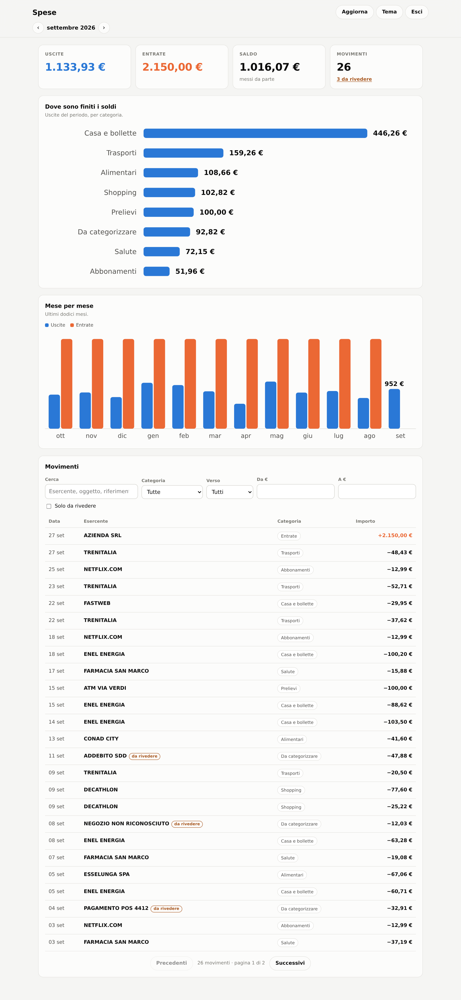

# EmailPagamenti

Legge le notifiche di movimento che la banca manda via email, ne ricostruisce importo,
esercente, data e categoria, e le salva su database. Sopra c'e' una dashboard per capire
dove sono finiti i soldi: quanto questo mese, in che categoria, presso chi.

Scritto in C# su .NET 9, pensato per girare in un contenitore su un server di casa.



## Come funziona

```
IMAP  ──▶  deduplica  ──▶  profilo banca  ──▶  categoria  ──▶  database  ──▶  dashboard
        (Message-Id)      (ING + generico)   (per esercente)   (EF Core)
```

1. **Acquisizione.** La casella viene aperta in sola lettura e le email arrivano in streaming
   a partire dall'ultima gia' vista, con una sovrapposizione configurabile perche' la posta
   puo' arrivare fuori ordine.
2. **Deduplica.** Ogni notifica e' identificata dall'hash SHA-256 del `Message-Id`, con indice
   unico a database. Gli hash di un intero lotto si controllano in una query sola.
3. **Riconoscimento.** Si sceglie il profilo della banca dal mittente o da una frase del testo,
   si cerca la formula che dice di che movimento si tratta, e si leggono i dettagli dai campi
   etichettati. Ogni riga salvata porta con se' la regola che l'ha prodotta.
4. **Categoria.** L'esercente viene confrontato con un elenco di parole chiave. Quello che non
   si riconosce resta "Da categorizzare" e la dashboard lo mette in evidenza.
5. **Revisione.** Sotto la soglia di confidenza il movimento finisce in "da rivedere". Si corregge
   dall'interfaccia, e la correzione a mano vince su qualsiasi regola.

## La banca

Il profilo **ING** (Conto Corrente Arancio) e' scritto su una notifica reale ed e' coperto da
test: il bonifico in uscita viene letto campo per campo, compreso il TRN. Le altre notifiche ING
(pagamenti con carta, prelievi, addebiti, accrediti) usano formule plausibili ma **non ancora
verificate su un esempio vero**: appena ne arriva una, basta aggiungerne il test.

Accanto c'e' un profilo generico italiano che fa da rete di sicurezza per qualunque altra banca,
con confidenza piu' bassa in modo che i suoi risultati passino dalla revisione.

Aggiungere una banca non richiede di ricompilare:

```json
{
  "Banks": {
    "Profiles": [
      {
        "Name": "La mia banca",
        "SenderContains": [ "labanca.it" ],
        "Patterns": [
          {
            "Name": "Pagamento carta",
            "Regex": "hai pagato\\s+(?<amount>[\\d.,]+\\s*euro)\\s+presso\\s+(?<merchant>[^\\r\\n]+)",
            "Kind": "CardPayment",
            "Direction": "Outgoing"
          }
        ]
      }
    ]
  }
}
```

I gruppi riconosciuti sono `amount`, `merchant`, `card`, `date`, `balance`, `reference`. Quelli
che la formula non cattura vengono cercati dalle espressioni comuni, che restano attive.

## Avvio su Proxmox

```bash
git clone https://github.com/luca930/EmailPagamenti.git
cd EmailPagamenti
cp .env.example .env
$EDITOR .env          # password dell'interfaccia e credenziali della casella
docker compose up -d --build
```

Poi l'interfaccia e' su `http://<indirizzo-del-server>:8080`. Il database sta nel volume
`spese-dati`: e' l'unica cosa da mettere nei backup.

Alla prima esecuzione vengono letti dodici mesi di storico, poi si rilegge ogni quarto d'ora.
Il bottone **Aggiorna** forza una lettura immediata.

## Sviluppo

```bash
dotnet restore
dotnet test
cd src/EmailPagamenti.Web
dotnet user-secrets set "Security:Password" "una-password-lunga"
dotnet user-secrets set "Imap:UserName" "tuo.indirizzo@gmail.com"
dotnet user-secrets set "Imap:Password" "password-per-app-a-16-cifre"
dotnet run
```

Per lavorare sull'interfaccia senza collegare la posta, basta spegnere l'acquisizione con
`Ingestion__Enabled=false`.

## Struttura

| Progetto | Contiene |
| --- | --- |
| `EmailPagamenti.Domain` | Entita', enum, `Money`. Nessuna dipendenza esterna. |
| `EmailPagamenti.Application` | Interfacce, profili banca, categorie, pipeline. |
| `EmailPagamenti.Infrastructure` | IMAP (MailKit), EF Core, registrazione dei servizi. |
| `EmailPagamenti.Web` | API, dashboard e acquisizione periodica. E' il contenitore. |
| `EmailPagamenti.Worker` | La sola acquisizione, senza interfaccia. |
| `EmailPagamenti.Tests` | Test su parser, categorie e aggregazioni su SQLite vero. |

## Configurazione

Tutto quello che non e' un segreto sta in `appsettings.json`.

| Sezione | Chiave | Significato |
| --- | --- | --- |
| `Security` | `Password` | Password dell'interfaccia. Solo da variabile d'ambiente. |
| `Security` | `RequireHttps` | Cookie solo su HTTPS. Da accendere dietro reverse proxy. |
| `Imap` | `Host`, `Port`, `Folders` | Server e cartelle da leggere. |
| `Imap` | `MaxMessagesPerRun` | Tetto per passata, per non bloccarsi su una casella storica. |
| `Ingestion` | `Enabled` | Spegne la lettura automatica: si legge solo dal bottone. |
| `Ingestion` | `InitialLookback` | Quanto storico recuperare la prima volta. |
| `Ingestion` | `MinConfidence` | Sotto questa soglia il movimento e' marcato "da rivedere". |
| `Ingestion` | `ReviewThreshold` | Sotto questa soglia l'email non viene salvata. |
| `Ingestion` | `BodySnippetLength` | Caratteri di corpo conservati. A `0` non se ne salva nessuno. |
| `Banks` | `Profiles` | Profili delle banche. |
| `Categories` | `Rules` | Categoria per parole chiave sull'esercente. |
| `Database` | `Provider` | `Sqlite` oppure `Postgres`. |

Aggiungere un esercente a una categoria:

```json
{
  "Categories": {
    "Rules": {
      "Alimentari": [ "il panificio sotto casa" ]
    }
  }
}
```

## Sicurezza

Qui dentro ci sono i movimenti di un conto corrente. Le scelte prese, e il perche':

- **Accesso con password obbligatorio.** L'applicazione **si rifiuta di partire** senza
  `Security__Password`, a meno di accendere esplicitamente `Security__AllowAnonymous`.
  Il confronto avviene sugli hash e a tempo costante, e i tentativi sono limitati a cinque
  al minuto per indirizzo.
- **Nessun segreto nel repository.** Credenziali solo da variabili d'ambiente o user-secrets.
  `.gitignore` e `.dockerignore` escludono `.env`, i database locali e i file di configurazione
  personali.
- **Casella in sola lettura.** La cartella IMAP viene aperta con `FolderAccess.ReadOnly`: il
  programma non puo' cancellare o modificare la posta nemmeno per errore.
- **Nessuna risorsa esterna.** L'interfaccia non carica font, script o CDN da fuori: i grafici
  sono SVG costruiti a mano. Questo permette una `Content-Security-Policy` stretta
  (`default-src 'self'`, niente script in linea) e fa funzionare tutto anche senza internet.
- **Minimizzazione dei dati.** Non si salva il corpo completo delle email ne' il contenuto degli
  allegati: solo un estratto configurabile, azzerabile del tutto.
- **Contenitore senza privilegi.** Il servizio gira come utente non root, con
  `no-new-privileges`, ed espone una sola porta.
- **Dipendenze sorvegliate.** `NuGetAudit` su tutto l'albero delle dipendenze e CodeQL a ogni push.

## Stato

Funzionante da capo a fondo: acquisizione, riconoscimento, categorie, dashboard, correzione a
mano, contenitore. Cosa manca, in ordine di utilita':

- Le formule ING per carta, prelievo e addebito vanno confermate su notifiche vere.
- Un budget mensile per categoria, con avviso quando ci si avvicina.
- Esportazione in CSV dei movimenti filtrati.
- Migrazioni EF Core al posto di `EnsureCreated`, quando lo schema si assesta.
